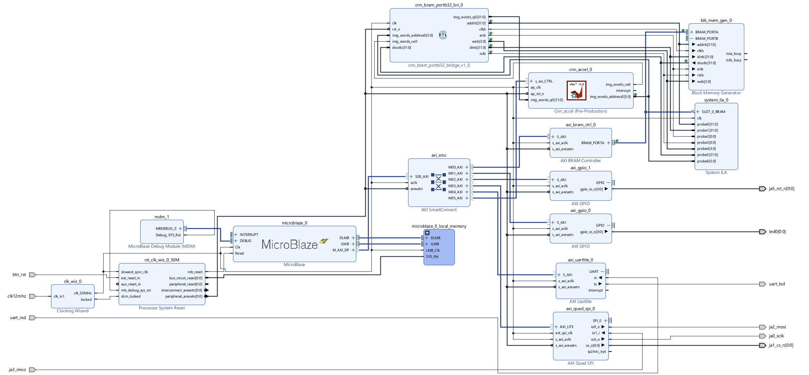

# FPGA MNIST CNN Accelerator on Cmod A7-35T with W5500 Ethernet and Local Web Demo



## Overview

This repository contains an end-to-end FPGA demo for handwritten digit recognition.

A small convolutional neural network is trained in TensorFlow/Keras on MNIST, resized to **14×14 pixels**, quantized, implemented as a **Vitis HLS CNN accelerator**, integrated in a **Vivado 2024.1** block design with **MicroBlaze**, and controlled by a bare-metal **Vitis 2024.1** application.

The final demo runs locally from a browser: the user draws a digit on a web canvas, the Python/Flask backend converts it into a 14×14 MNIST-like frame, sends it via UDP to the FPGA, the CNN accelerator classifies it, and the FPGA sends the prediction back via UDP.

> Toolchain used: **Vivado 2024.1** and **Vitis / Vitis HLS 2024.1**.

---

## Key Features

- TensorFlow/Keras CNN trained on MNIST
- MNIST resized to **14×14 grayscale**
- Quantized weights exported to a C header
- Vitis HLS CNN accelerator
- MicroBlaze-based embedded system
- Shared BRAM between MicroBlaze and the CNN accelerator
- External **WIZnet W5500 Ethernet module** connected via SPI
- UDP image-transfer protocol
- UDP result-response protocol
- Local Flask web interface for drawing digits
- UART debug commands
- Vivado block design included as an openable project source

---

## Hardware Platform

Target board:

```text
Digilent Cmod A7-35T
FPGA: Xilinx Artix-7 XC7A35T-1CPG236C
Toolchain: Vivado/Vitis 2024.1
```

External Ethernet module:

```text
WIZnet W5500 Ethernet module
Interface: SPI
```

The **Cmod A7-35T does not include a built-in Ethernet connector**.  
Ethernet communication is implemented with an external W5500 module. The W5500 exposes an SPI interface, which is connected to the FPGA through an **AXI Quad SPI** peripheral. The W5500 reset pin is controlled through **AXI GPIO**. The pin mapping is defined in the XDC constraints file.

---

## System Architecture

```text
Browser Canvas
      |
      | HTTP POST
      v
Local Flask Server
      |
      | UDP packet: MNST + seq + label + image[196]
      v
W5500 Ethernet Module
      |
      | SPI
      v
MicroBlaze Firmware
      |
      | writes packed image to shared BRAM
      v
Vitis HLS CNN Accelerator
      |
      | predicted digit
      v
MicroBlaze Firmware
      |
      | UDP response: RSLT + seq + prediction
      v
Local Flask Server
      |
      v
Browser Result
```

---

## Vivado Block Design

The Vivado design includes:

- MicroBlaze
- MicroBlaze Debug Module
- Clocking Wizard
- Processor System Reset
- AXI SmartConnect
- AXI Quad SPI for the W5500 module
- AXI UARTLite for serial debug
- AXI GPIO for LEDs and W5500 reset
- AXI BRAM Controller
- Block Memory Generator
- Custom BRAM bridge: `cnn_bram_portb32_bridge`
- Vitis HLS CNN accelerator IP: `cnn_accel`
- System ILA for internal signal probing

The shared BRAM stores the packed 14×14 input image. MicroBlaze writes the frame into BRAM, while the HLS CNN accelerator reads the same memory through a BRAM-side interface.

---

## Repository Structure

```text
.
├── README.md
├── .gitignore
├── colab/
│   ├── CNN_on_FPGA_project.ipynb
│   ├── mnist_cnn_fpga.keras
│   ├── mnist_cnn_fpga_weights.npz
│   ├── test_samples.npz
│   └── weights_fpga.h
├── docs/
│   └── images/
│       └── vivado_block_design.png
├── hls/
│   ├── cnn_accel.cpp
│   ├── cnn_accel.h
│   ├── tb_cnn_accel.cpp
│   └── weights_fpga.h
├── scripts/
│   └── send_mnist_udp_mac_debug.py
├── vitis/
│   └── src/
│       └── app_main.c
├── vivado/
│   └── CNN_on_FPGA_pj/
│       ├── CNN_on_FPGA_pj.xpr
│       └── CNN_on_FPGA_pj.srcs/
└── web_app/
    ├── app.py
    └── requirements.txt
```

---

## Open the Vivado Project

This repository includes a cleaned Vivado project source folder:

```text
vivado/CNN_on_FPGA_pj/
```

To open it:

1. Open **Vivado 2024.1**.
2. Select **Open Project**.
3. Open:

```text
vivado/CNN_on_FPGA_pj/CNN_on_FPGA_pj.xpr
```

4. Open the Block Design:

```text
CNN_on_FPGA_BD
```

5. Run:

```text
Validate Design
Generate Output Products
Generate Bitstream
```

6. Export the hardware:

```text
File → Export → Export Hardware
```

Select:

```text
Include bitstream
```

This generates the `.xsa` file needed by Vitis.

> Note: generated folders such as `.cache`, `.gen`, `.hw`, `.ip_user_files`, `.runs`, `.sim`, `.tmp`, and `.Xil` are intentionally not part of the Git repository. Vivado can regenerate them.

---

## Rebuild the HLS IP

The HLS source files are in:

```text
hls/
```

Use **Vitis HLS 2024.1**.

Add these design files:

```text
cnn_accel.cpp
cnn_accel.h
weights_fpga.h
```

Add this testbench file:

```text
tb_cnn_accel.cpp
```

Top function:

```text
cnn_accel
```

Target part for Cmod A7-35T:

```text
xc7a35tcpg236-1
```

Suggested HLS settings:

```text
clock: 10ns
flow target: Vivado IP Flow Target
package output: Generate Vivado IP and .zip archive
```

Then run:

```text
C Simulation
C Synthesis
Export RTL / Package IP
```

After exporting the IP, update the IP in Vivado, regenerate the bitstream, export the `.xsa`, update the Vitis platform, rebuild the application, and program the FPGA.

---

## CNN Input Format

The CNN input frame is:

```text
14 × 14 grayscale = 196 pixels
```

The frame is packed into:

```text
49 words × 32 bits
```

Each 32-bit word contains 4 pixels:

```text
word[7:0]    = pixel 0
word[15:8]   = pixel 1
word[23:16]  = pixel 2
word[31:24]  = pixel 3
```

---

## UDP Protocol

### Input Packet: PC/Web App → FPGA

```text
byte 0..3    magic: 'M' 'N' 'S' 'T'
byte 4..7    sequence number, big-endian
byte 8       label, optional; 0xFF when unknown
byte 9..204  image payload, 196 bytes
```

Total length:

```text
205 bytes
```

### Output Packet: FPGA → PC/Web App

```text
byte 0..3    magic: 'R' 'S' 'L' 'T'
byte 4..7    sequence number, big-endian
byte 8       predicted digit
byte 9       OK flag
byte 10      received label
byte 11      reserved
```

Total length:

```text
12 bytes
```

---

## Network Configuration

The firmware currently uses:

```text
FPGA/W5500 IP: 192.168.8.50
UDP port:      5000
MAC address:   02:00:00:00:00:01
```

Example host configuration:

```text
PC/Mac Ethernet IP: 192.168.8.20
Subnet mask:        255.255.255.0
```

On macOS, for example:

```bash
sudo ifconfig en7 inet 192.168.8.20 netmask 255.255.255.0
route -n get 192.168.8.50
```

The route should point to the USB Ethernet interface.

---

## Run the Local Web Demo

Install dependencies:

```bash
cd web_app
python3 -m pip install -r requirements.txt
```

Run:

```bash
python3 app.py \
  --fpga-ip 192.168.8.50 \
  --fpga-port 5000 \
  --host 127.0.0.1 \
  --port 8000
```

Open:

```text
http://127.0.0.1:8000
```

Draw a digit and press **Predict**.

---

## UART Debug Commands

The Vitis firmware supports manual UART commands:

```text
t = write pattern 0..195 to BRAM
r = dump first 8 BRAM words
R = dump all 49 BRAM words
g = run CNN on current BRAM
d = dump HLS debug regs
x = dump raw HLS AXI-Lite regs
```

A key validation step is:

```text
t
g
```

Expected debug behavior:

```text
P0 = W00
P1 = W01
...
P7 = W07
HLS_BRAM_VERIFY_OK
```

This verifies that the HLS accelerator is reading the shared BRAM correctly.

---

## What Is Included and What Is Excluded

Included:

```text
source files
constraints
custom RTL
HLS code
Vitis firmware
Colab notebook
web application
clean Vivado project source folder
documentation and screenshots
```

Excluded from Git:

```text
Vivado generated cache/output folders
Vitis build folders
HLS generated implementation folders
.bit files
.xsa files
large generated archives
```

Generated files can be recreated using Vivado/Vitis 2024.1. If desired, `.bit`, `.xsa`, and a full prebuilt project archive can be attached as GitHub Release assets instead of being tracked in Git.
